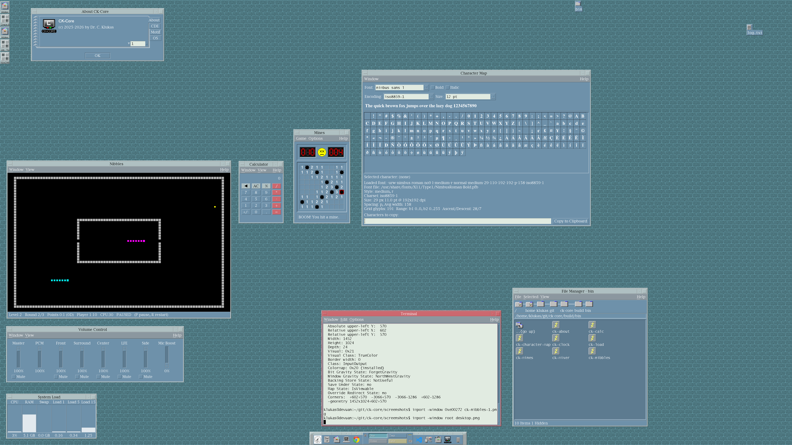
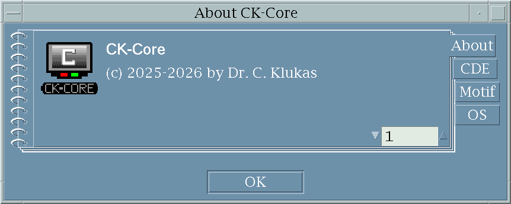
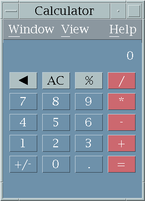
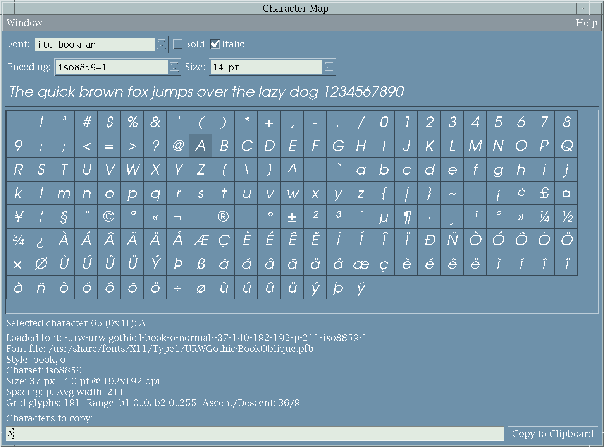
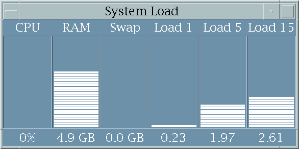
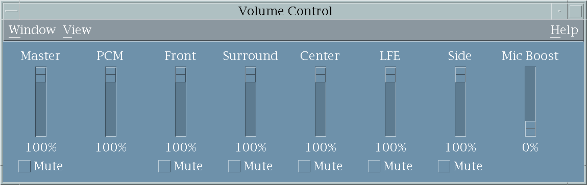
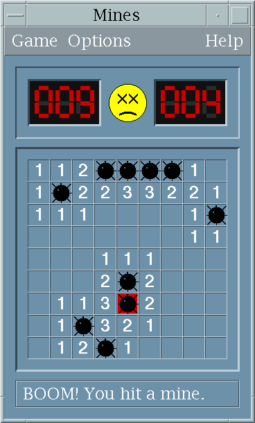
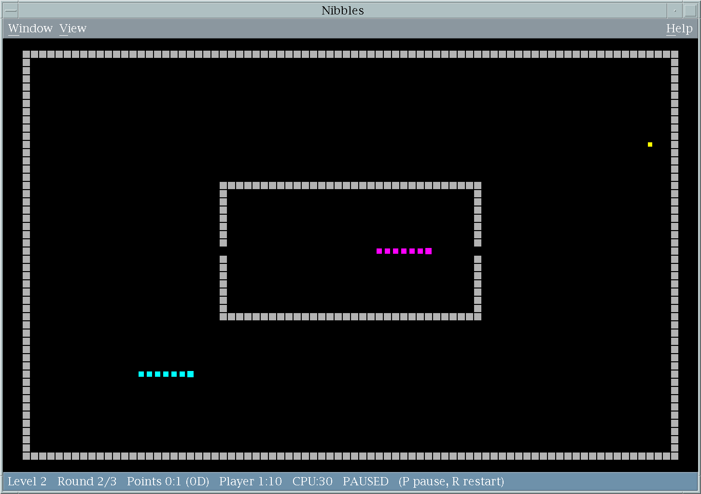

# CK-Core App Suite

**Motif/CDE utilities and games**

Example desktop screenshot showing running CK-Core apps: 



**Execution environment:**

* **CDE:** 2.5.3, compiled from adapted source ([link](https://github.com/cklukas/ck-core-cde))
* **Motif:** 2.3.8, compiled from source
* **Operating system:** Devuan 6 (arm64) running in VMware Fusion on Mac M1.
* **Display:** 4k

---

**Info:** High-DPI is still a bit problematic. E.g., icons on desktop and start panel at bottom are too small. I can hopefully fix that one day in the project [ck-core-cde](https://github.com/cklukas/ck-core-cde).

---

## Apps

### About CK-Core (ck-about)

CDE About dialog with notebook pages that report CDE version and platform details.



### Calculator (ck-calc)

Basic calculator with a classic desktop layout, session handling, and multiple-window support.



### Character Map (ck-character-map)

Character map and glyph browser with font selection and copy/paste support.



### ck-clock

Analog front-panel clock rendered with cairo and Motif color sets.

### System Load (ck-load)

System load monitor showing CPU, RAM, swap usage, and 1/5/15-minute load averages.



### Volume Control (ck-mixer)

ALSA mixer frontend with per-channel sliders, mute toggles, and device selection.



### Mines (ck-mines)

Minesweeper clone built for Motif/CDE with configurable grid and classic flags/reveals.



### Nibbles (ck-nibbles)

QBasic-style Nibbles (snake) clone with 1- or 2-player support and keyboard controls.



## Build

Prerequisites: a C compiler plus the development headers for Motif/X11, the CDE libraries, ALSA (`-lasound`), and cairo (for `ck-clock`).

Build everything into `build/bin`:

```sh
make
```

The Makefile assumes CDE is under `/usr/local/CDE`; override if needed:

```sh
make CDE_PREFIX=/opt/cde
```

Other knobs:
- `BUILD_DIR=out` changes the build output root.
- `CC=clang` or `CFLAGS='-g -O0'` to tweak compilation.

Cleaning:

```sh
make clean
```

The legacy `compile.sh` scripts in each `src/ck-*` directory now delegate to the Makefile so the binaries are always placed under `build/bin`.
